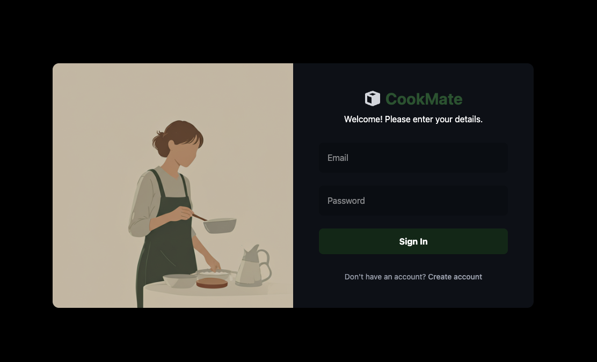
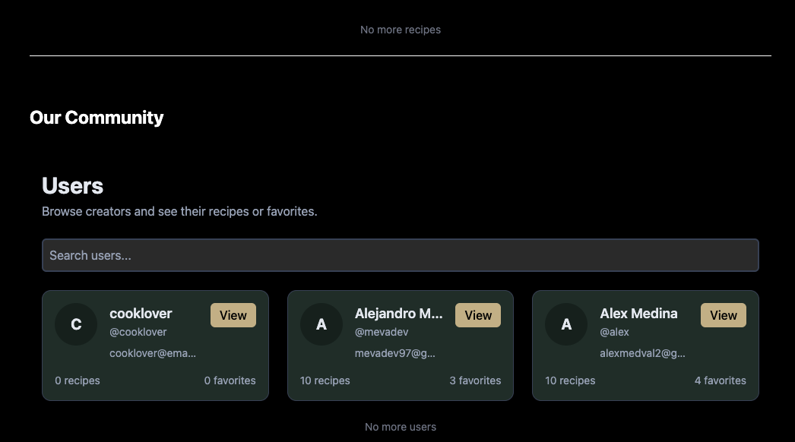
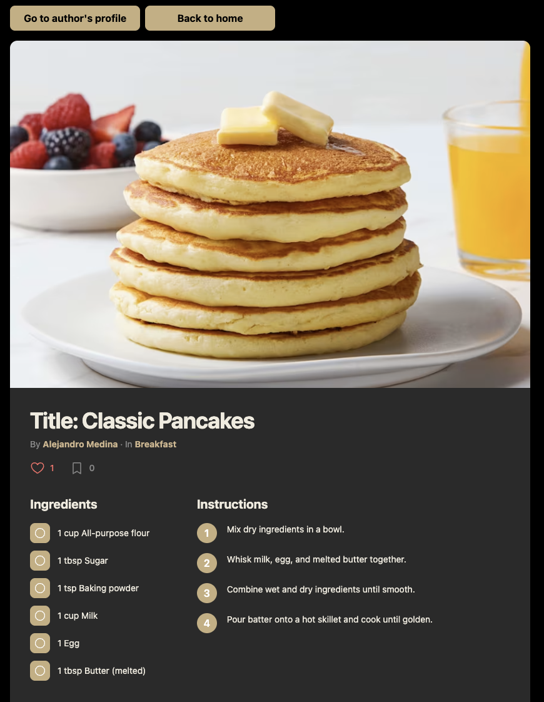
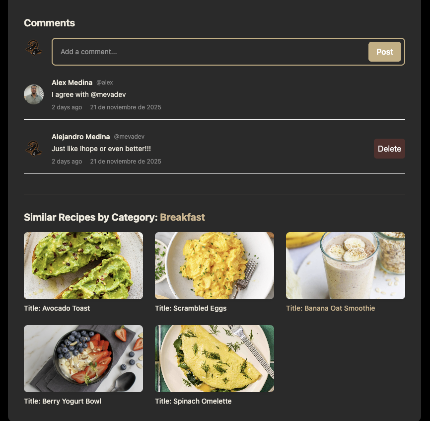
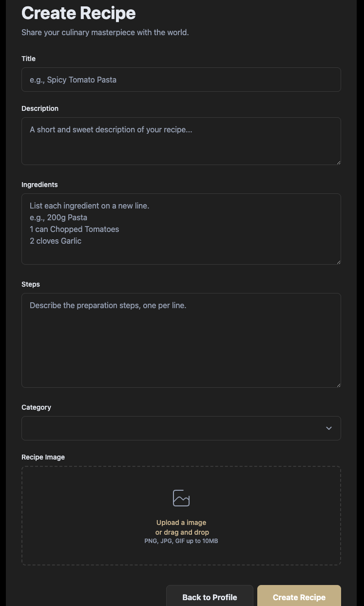
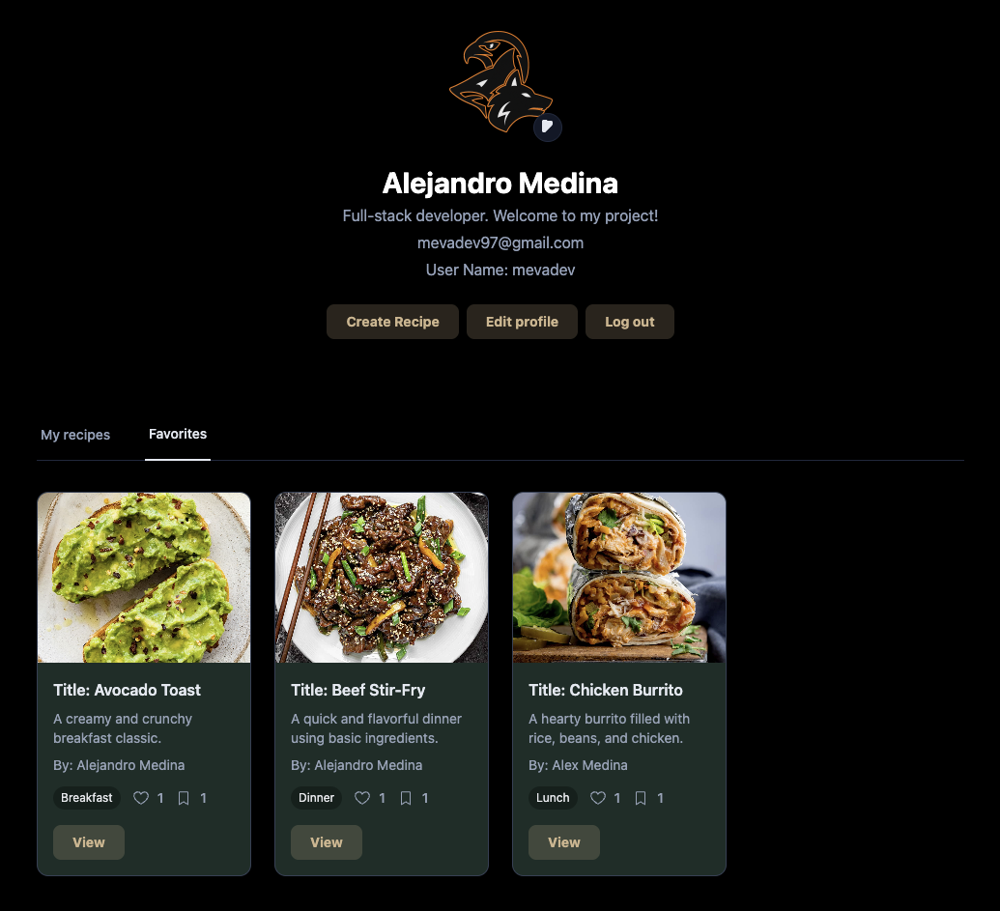
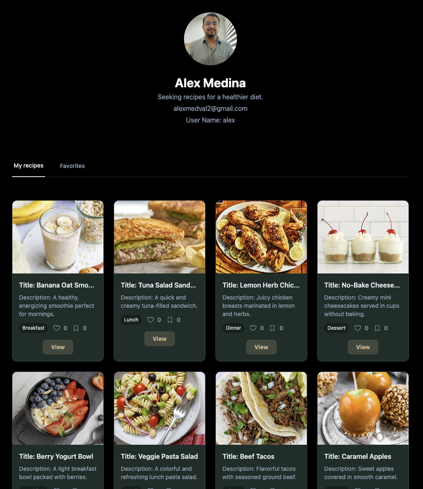

# cookMate — Frontend

This repository contains the frontend for cookMate — a recipe-sharing web app. The app is built with React + TypeScript, uses Vite for development, and communicates with a separate backend REST API (see the `cookMate_backend` repo).

This README documents how to run the project and summarizes the most relevant parts of the current codebase and developer workflows.

---

## Live demo

A live demo of this project is deployed on Netlify and available at:

[https://cookmate-mevadev.netlify.app/](https://cookmate-mevadev.netlify.app/)

---

## Highlights

- React + TypeScript
- Vite for fast dev + HMR
- Tailwind CSS for utility-first styling
- React Query (@tanstack/react-query) for data fetching and caching
- Axios as the HTTP client (centralized `src/config/axios.ts` with auth helper)
- react-hook-form for form handling
- Sonner for toasts/notifications
- pnpm (recommended) for package management; npm/yarn supported

## Recent additions

- Landing page (`/`) with project overview and 'Enter the App' CTA.
- Profile image uploader component with Cloudinary uploads and client-side preview.
- Unified `RecipeForm` component reused by create & edit recipe pages.
- Pagination support on backend + frontend; `useInfiniteQuery` used in list views.
- Optimistic updates for comments and per-item delete UI improvements.
- Backend/Frontend fixes for favorites/likes sync and author population in favorites endpoint.
- Defensive Cloudinary handling: previous profile image deletion and robust upload parsing.

Recent features in this codebase

- Paginated APIs for recipes and users (`getAllRecipes` and `getAllUsersPaged`) with frontend use of `useInfiniteQuery`.
- Upload-first image flow for recipes (upload image → receive URL → submit recipe).
- Edit recipe UI (prefill, change/remove image) and delete confirmation modal.
- Shared `Logo` component and other small UI components (`Spinner`, `DeletionConfirm`, `ShowPassword`, `HidePassword`, etc.).

---

## Screenshots

Below is a compact gallery of UI screenshots (images come from `frontend/public`). The grid uses HTML so it renders consistently on GitHub.

<table>
  <tr>
    <td align="center">
      <figure>
        
        <figcaption>Login</figcaption>
      </figure>
    </td>
    <td align="center">
      <figure>
        
        <figcaption>Register</figcaption>
      </figure>
    </td>
    <td align="center">
      <figure>
        
        <figcaption>Landing / Entry</figcaption>
      </figure>
    </td>
  </tr>
  <tr>
    <td align="center">
      <figure>
        
        <figcaption>Home (recipes)</figcaption>
      </figure>
    </td>
    <td align="center">
      <figure>
        
        <figcaption>Home (users)</figcaption>
      </figure>
    </td>
    <td align="center">
      <figure>
        
        <figcaption>Recipe details</figcaption>
      </figure>
    </td>
  </tr>
  <tr>
    <td align="center">
      <figure>
        
        <figcaption>Comments</figcaption>
      </figure>
    </td>
    <td align="center">
      <figure>
        
        <figcaption>Create recipe</figcaption>
      </figure>
    </td>
    <td align="center">
      <figure>
        
        <figcaption>Profile (logged user)</figcaption>
      </figure>
    </td>
  </tr>
  <tr>
    <td align="center">
      <figure>
        
        <figcaption>Favorites</figcaption>
      </figure>
    </td>
    <td align="center">
      <figure>
        
        <figcaption>Unauthorized profile</figcaption>
      </figure>
    </td>
    <td></td>
  </tr>
</table>

_Images are included for convenience — open the app locally to interact with the UI._

---

## Tech stack

- Framework: React (TypeScript)
- Tooling: Vite
- Styling: Tailwind CSS
- Data fetching: @tanstack/react-query
- HTTP: axios
- Forms: react-hook-form
- Routing: react-router-dom
- Notifications: sonner
- Linting: ESLint

---

## Getting started

Prerequisites

- Node.js 18+
- pnpm (recommended) or npm/yarn

Install dependencies (frontend):

```bash
pnpm install
# or
npm install
```

Add environment variables (create a `.env.local` or `.env` in `frontend/`):

```
VITE_API_URL=http://localhost:4000/api
```

Run the frontend dev server:

```bash
pnpm dev
# or
npm run dev
```

Start the backend (from the backend repo) so the frontend can talk to the API:

```bash
# from /path/to/cookMate_backend
pnpm install
pnpm dev
```

---

## Available scripts (package.json)

- `dev` — start Vite dev server (local development)
- `build` — build production assets
- `preview` — preview a production build
- `lint` — run ESLint

---

## Environment variables

Client-side environment variables must start with `VITE_`.

- `VITE_API_URL` — base URL for the backend API (e.g. `http://localhost:4000/api`).

The project also stores the auth token in `localStorage` and sets `Authorization: Bearer <token>` automatically via `src/config/axios.ts` when present.

---

## Project structure (key files)

Top-level

- `index.html`, `package.json`, `pnpm-lock.yaml`, `vite.config.ts`, `tsconfig.json`

Important folders

- `src/`
  - `main.tsx` — app bootstrap and router
  - `api/CookMateAPI.ts` — centralized axios calls and typed API helpers (includes `getAllRecipes`, `getAllUsersPaged`, `uploadRecipeImage`, `updateRecipeById`, `deleteRecipeById`)
  - `config/axios.ts` — axios instance and `setAuthToken` helper
  - `layouts/` — `AuthLayout`, `HomeLayout`, `ProfileLayout` (use shared `Logo`)
  - `views/` — page views like `HomeView`, `HomeRecipesView`, `HomeUsersView`, auth views and profile views
  - `components/` — reusable UI pieces: `Logo.tsx`, `Spinner.tsx`, `DeletionConfirm.tsx`, `DeleteRecipeButton.tsx`, password toggles, etc.
  - `db/` — seed/static data (e.g. categories)
  - `tests/` — unit and integration tests (if present in repo)

---

## API contract notes (frontend <-> backend)

- `GET /recipes?page=1&limit=20` → returns paged shape:
  ```json
  { "recipes": [...], "page": 1, "limit": 20, "total": 123, "hasMore": true }
  ```
- `GET /user?page=1&limit=20` → returns paged users: `{ users: [...], page, limit, total, hasMore }`.
- `POST /recipes/upload-image` — accepts multipart/form-data and returns `{ imageUrl: "https://..." }`.
- `POST /recipes/upload-image` — accepts multipart/form-data and returns `{ imageUrl: "https://..." }`.
- `POST /user/:userId/image` — accepts multipart/form-data, uploads to Cloudinary and returns `{ imageUrl: "https://...", user: {...} }`; backend may also persist `user.image`.
- `PUT /recipes/:id` — update recipe; server checks author ownership.
- `DELETE /recipes/:id` — delete recipe; server checks author ownership and removes references.

Notes:

- `GET /user/:userId/favorites` returns recipe objects; recent backend updates populate the `author` field (e.g. `author.name`, `author.handle`, `author.image`).

The frontend includes helpers and components that assume these shapes (see `src/api/CookMateAPI.ts` and the `HomeRecipesView` / `HomeUsersView` implementations).

---

## Developer notes & conventions

- Use `react-query` keys consistently (examples in code: `['getAllRecipes']`, `['userProfile', userId]`, `['recipeInfo', recipeId]`).
- Upload-first flow: upload images first → get URL → include URL in create/update payload for the recipe.
- Keep `dark:` Tailwind classes for dark mode; many components apply `bg-green-950/80` for the primary light-mode styles.
- When updating requests/responses, update the corresponding helper in `src/api/CookMateAPI.ts` and adjust react-query consumers.

---

## Contributing

- Open an issue first if the change is non-trivial.
- Fork, create a branch, and open a pull request. Keep changes focused and include tests where appropriate.
- Run linting before submitting PRs: `pnpm lint`.

---

## Backend

Backend repo: https://github.com/Meva1997/cookMate_backend

The backend exposes REST endpoints for auth, recipes, users, favorites and comments. The frontend expects the API to return the paged shapes described above for lists.

---

## Contact / License

- Owner: https://github.com/Meva1997

If you want a license file added, create a `LICENSE` at the project root (e.g. MIT).
