<div align="center">

# 🍳 CookMate

### Modern Full-Stack Recipe Sharing Platform

<p align="center">
  <strong>A production-ready web application built with modern React patterns, TypeScript, and enterprise-grade architecture</strong>
</p>

[](https://cookmate-mevadev.netlify.app/)
[](https://www.typescriptlang.org/)
[](https://reactjs.org/)
[](https://vitejs.dev/)
[](https://tailwindcss.com/)

[🚀 View Live Demo](https://cookmate-mevadev.netlify.app/) • [📖 Backend Repository](https://github.com/Meva1997/cookMate_backend)

</div>

---

## 🎯 Project Overview

CookMate is a full-featured social recipe platform where users can create, share, and discover recipes. Built as a demonstration of modern web development practices, this project showcases proficiency in React ecosystem, TypeScript, API integration, state management, and responsive design.

### ✨ Key Technical Highlights

- **🏗️ Modern React Architecture**: Component-based design with custom hooks and context patterns
- **⚡ Performance Optimized**: Infinite scroll with `useInfiniteQuery`, optimistic updates, and smart caching strategies
- **🔐 Secure Authentication**: JWT-based auth with axios interceptors and protected routes
- **📱 Responsive Design**: Mobile-first approach using Tailwind CSS with dark mode support
- **🎨 Enhanced UX**: Real-time updates, toast notifications, loading states, and error boundaries
- **☁️ Cloud Integration**: Cloudinary for image uploads with client-side preview and optimization
- **🔄 State Management**: React Query for server state, React Hook Form for form state
- **📊 Pagination Strategy**: Efficient infinite loading pattern for large datasets
- **🧪 Type Safety**: Comprehensive TypeScript coverage with strict mode enabled

---

---

## 🛠️ Tech Stack

### Frontend

| Technology          | Purpose                                                   |
| ------------------- | --------------------------------------------------------- |
| **React 19**        | UI library with latest concurrent features                |
| **TypeScript 5.9**  | Type safety and developer experience                      |
| **Vite 7**          | Lightning-fast build tool and dev server                  |
| **Tailwind CSS 4**  | Utility-first styling with JIT compiler                   |
| **React Query**     | Async state management, caching, and data synchronization |
| **React Router v7** | Client-side routing and navigation                        |
| **React Hook Form** | Performant form validation and management                 |
| **Axios**           | HTTP client with interceptors for auth                    |
| **Sonner**          | Toast notifications with elegant animations               |
| **React Icons**     | Comprehensive icon library                                |

### Backend (Separate Repository)

- **Node.js + Express** - RESTful API server
- **MongoDB + Mongoose** - NoSQL database with ODM
- **JWT** - Stateless authentication
- **Cloudinary** - Cloud-based image storage and transformation
- **Jest + Supertest** - Unit and integration testing (>80% coverage)
- **Swagger** - Interactive API documentation

---

## 🎨 Features & Functionality

### User Experience

- ✅ **Authentication & Authorization** - Secure signup/login with JWT tokens
- ✅ **Recipe Management** - Create, edit, and delete your own recipes
- ✅ **Social Interactions** - Like recipes, add to favorites, and comment
- ✅ **User Profiles** - Customizable profiles with image uploads
- ✅ **Infinite Scroll** - Smooth pagination for recipes and users
- ✅ **Category Filtering** - Browse recipes by cuisine type
- ✅ **Search & Discovery** - Find recipes and connect with other users
- ✅ **Responsive Design** - Seamless experience across all devices
- ✅ **Dark Mode Support** - Modern UI with theme consistency

### Developer Features

- 🔄 **Optimistic UI Updates** - Instant feedback for user actions
- 🎯 **Type-Safe API Layer** - Fully typed HTTP requests and responses
- 🧩 **Reusable Components** - DRY principles with component composition
- 🔐 **Protected Routes** - Route guards for authenticated-only pages
- 🎪 **Error Boundaries** - Graceful error handling and recovery
- 📦 **Code Splitting** - Optimized bundle sizes with lazy loading
- 🔧 **Environment Configuration** - Separate dev/prod configurations
- 📝 **ESLint + TypeScript** - Strict linting for code quality

---

---

## 📸 Application Screenshots

<div align="center">

### Authentication & Landing

<table>
  <tr>
    <td align="center" width="33%">
      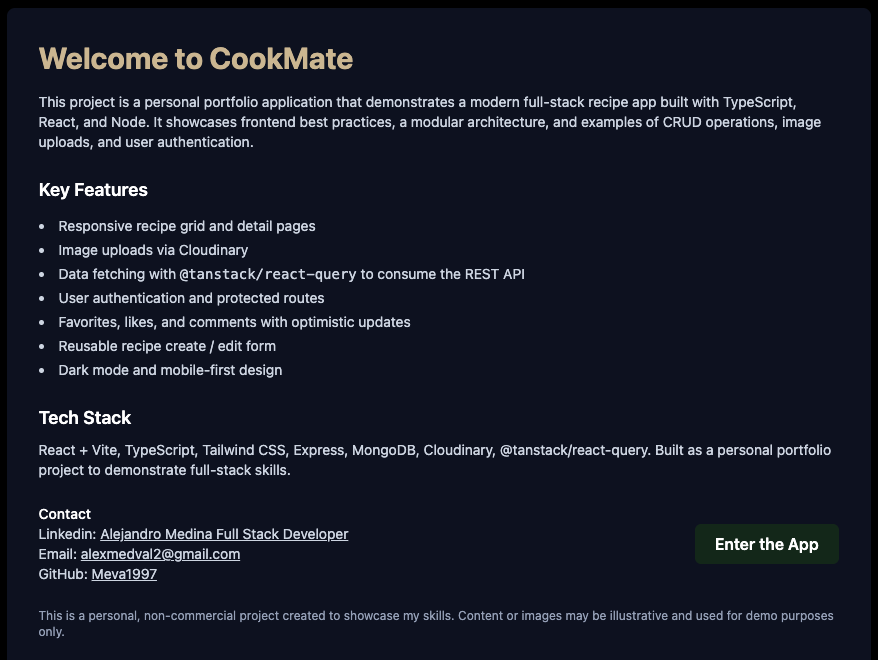
      <br />
      <sub><b>Landing Page</b></sub>
    </td>
    <td align="center" width="33%">
      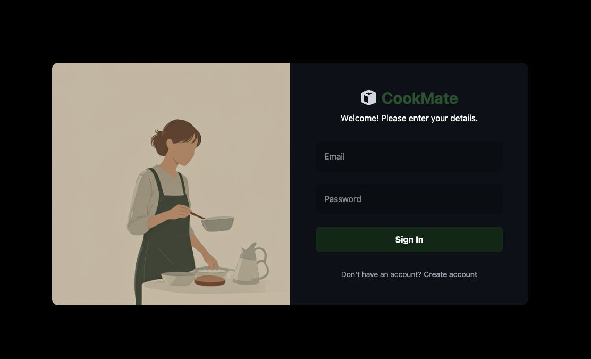
      <br />
      <sub><b>Login View</b></sub>
    </td>
    <td align="center" width="33%">
      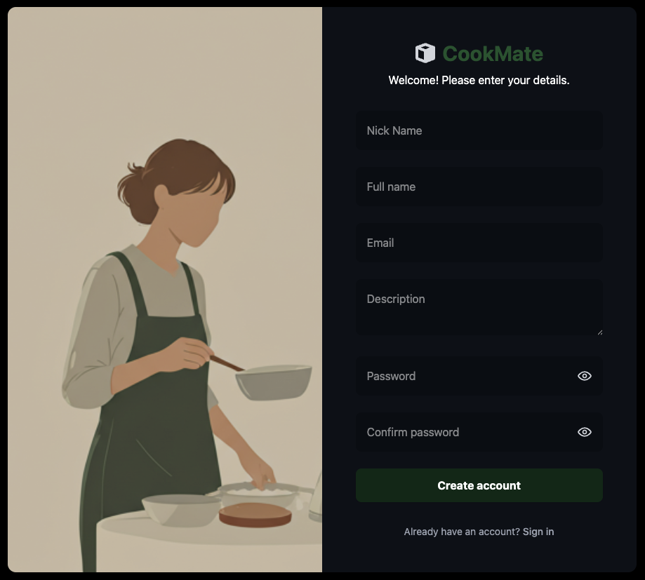
      <br />
      <sub><b>Sign Up</b></sub>
    </td>
  </tr>
</table>

### Main Features

<table>
  <tr>
    <td align="center" width="33%">
      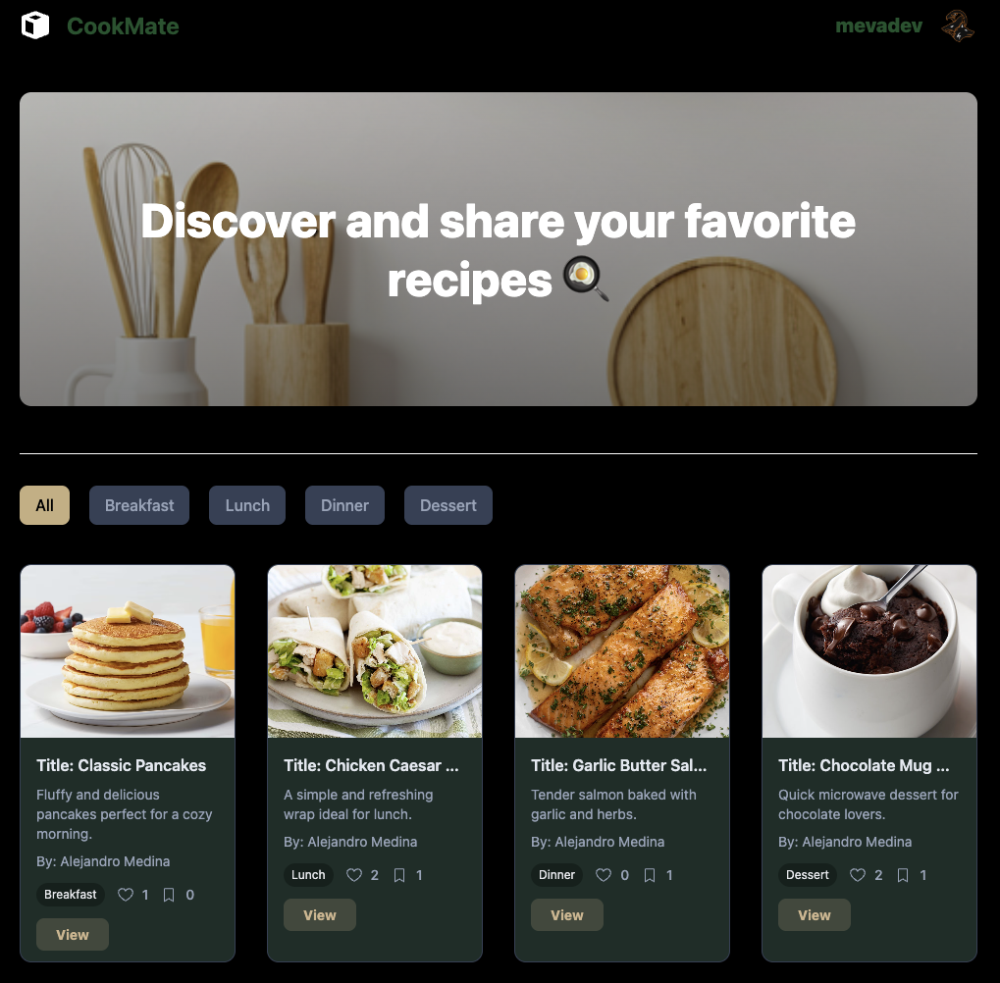
      <br />
      <sub><b>Recipe Feed with Infinite Scroll</b></sub>
    </td>
    <td align="center" width="33%">
      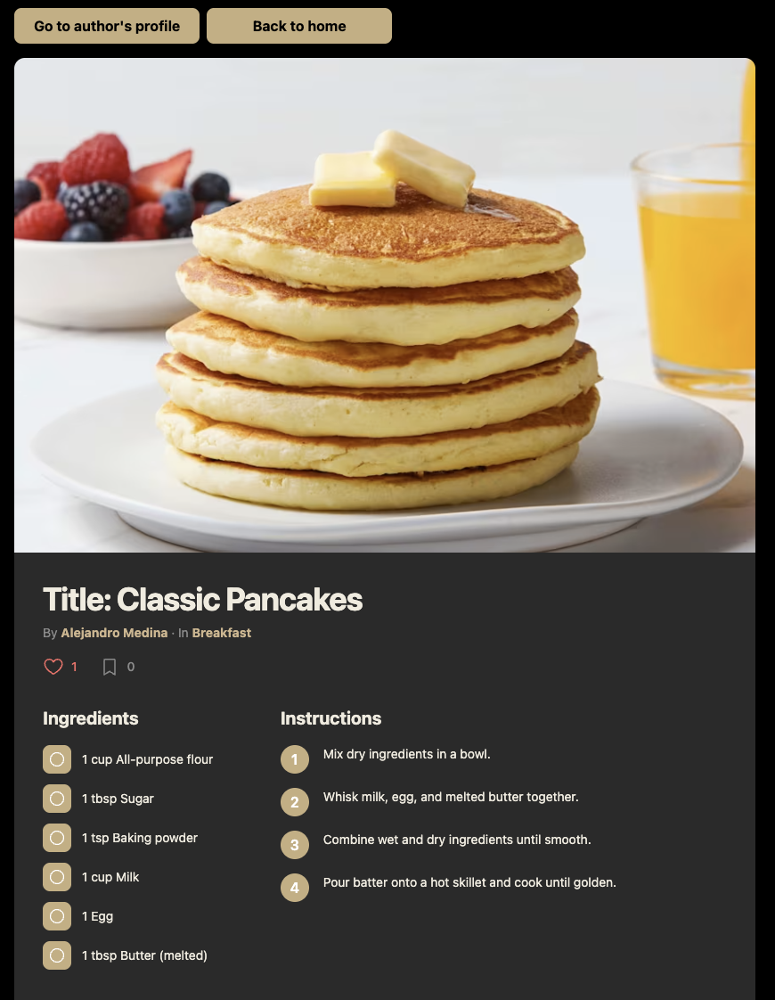
      <br />
      <sub><b>Recipe Details & Interactions</b></sub>
    </td>
    <td align="center" width="33%">
      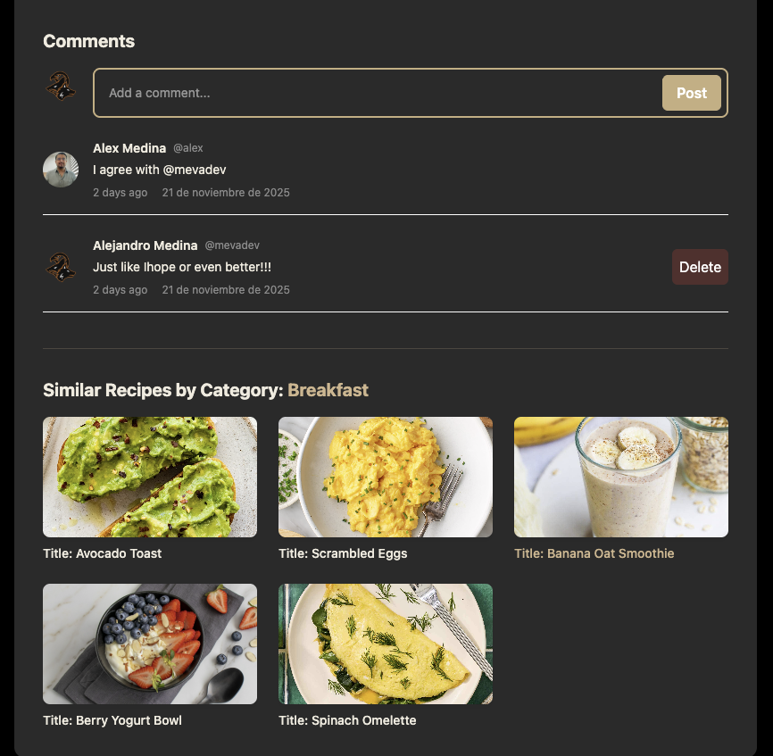
      <br />
      <sub><b>Real-time Comments</b></sub>
    </td>
  </tr>
</table>

### User Experience

<table>
  <tr>
    <td align="center" width="33%">
      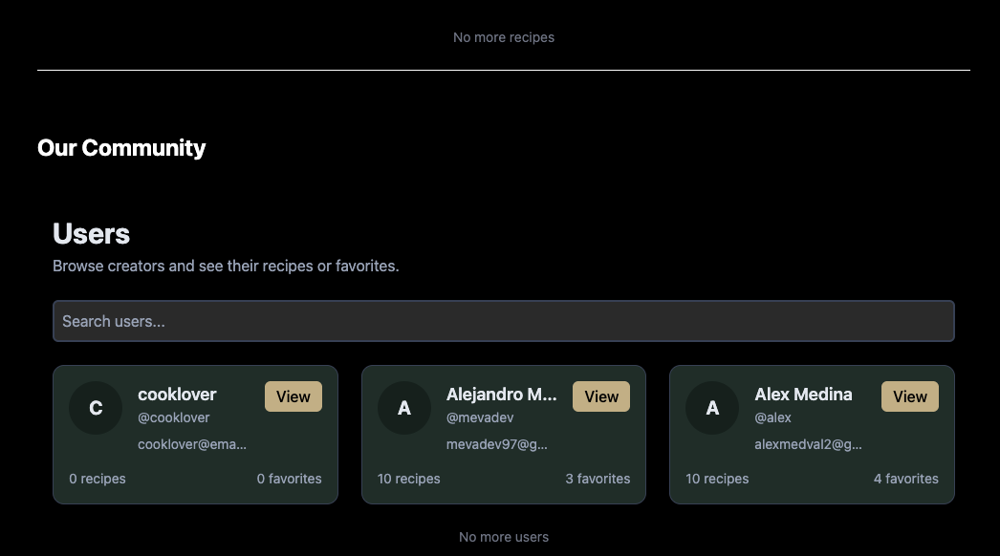
      <br />
      <sub><b>User Discovery</b></sub>
    </td>
    <td align="center" width="33%">
      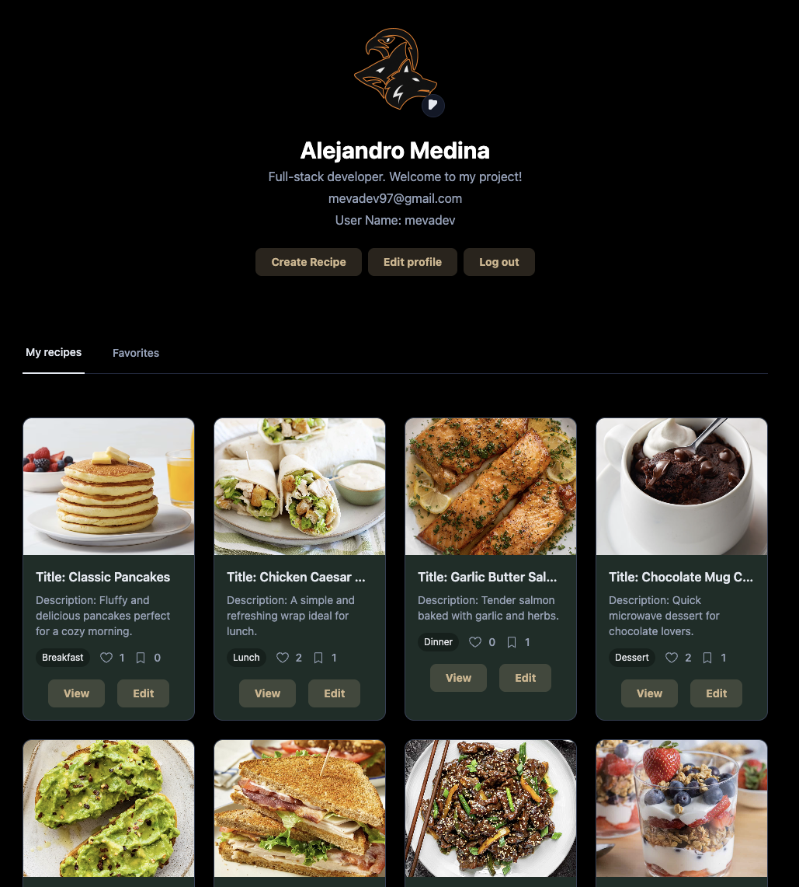
      <br />
      <sub><b>Profile Management</b></sub>
    </td>
    <td align="center" width="33%">
      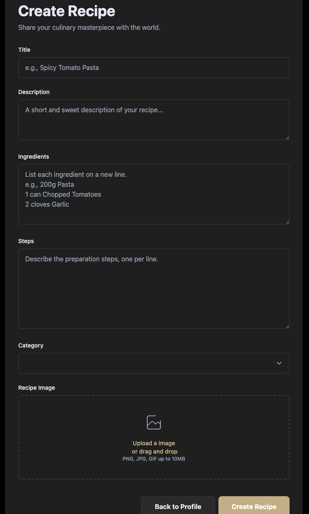
      <br />
      <sub><b>Recipe Creation Form</b></sub>
    </td>
  </tr>
  <tr>
    <td align="center" width="33%">
      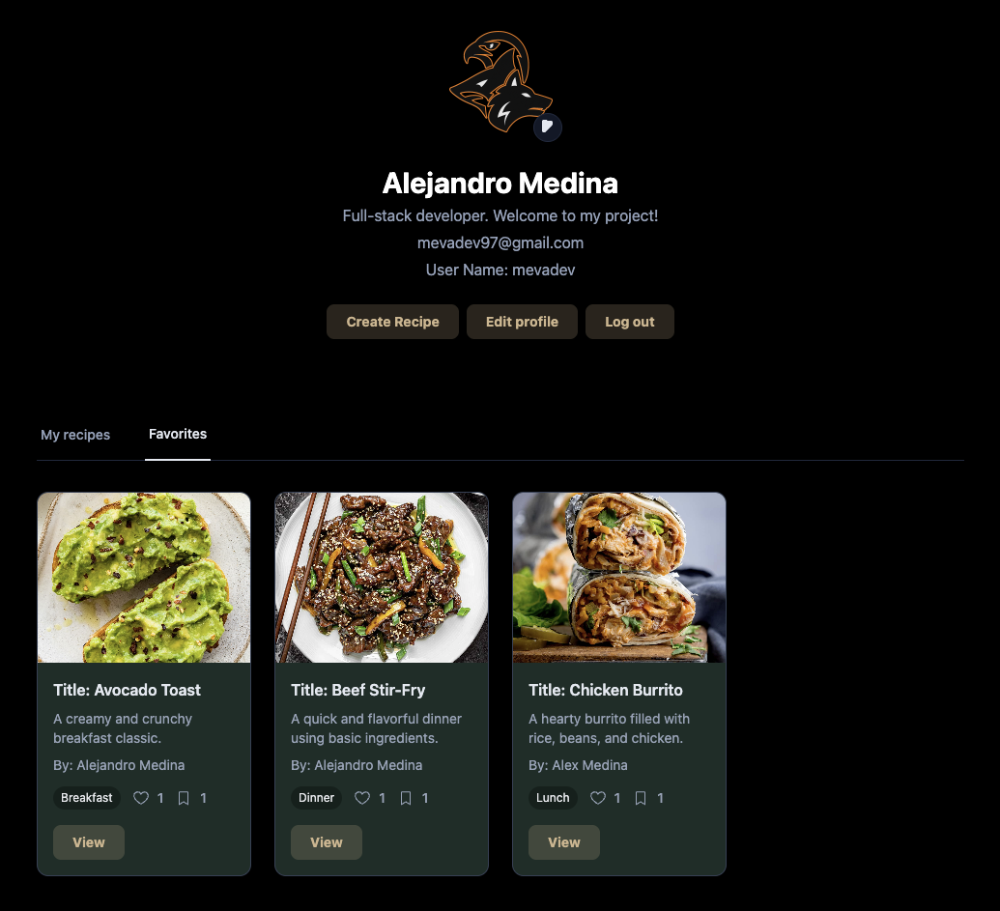
      <br />
      <sub><b>Saved Favorites</b></sub>
    </td>
    <td align="center" width="33%">
      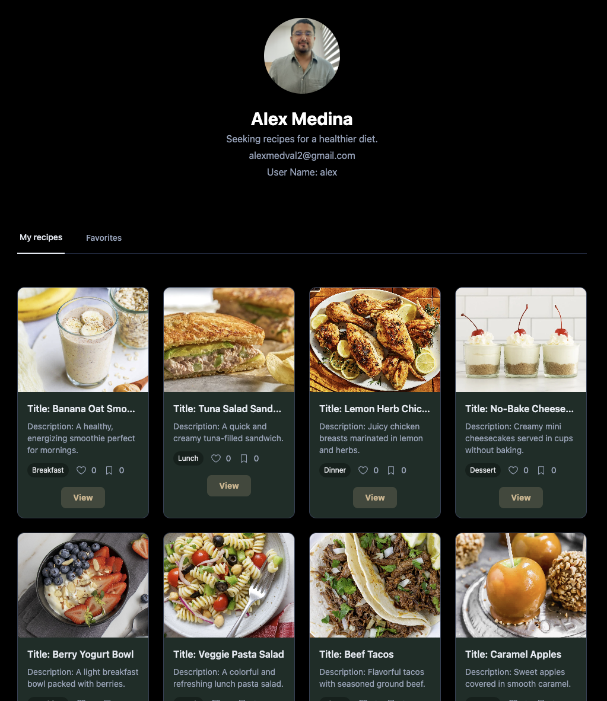
      <br />
      <sub><b>Public Profile View</b></sub>
    </td>
    <td align="center" width="33%">
      <!-- Empty cell for symmetry -->
    </td>
  </tr>
</table>

</div>

---

## 🏗️ Architecture & Patterns

### Project Structure

```
frontend/
├── src/
│   ├── api/              # API client and HTTP request handlers
│   │   └── CookMateAPI.ts    # Centralized API methods
│   ├── components/       # Reusable UI components
│   │   ├── ErrorBoundary.tsx
│   │   ├── RecipeForm.tsx
│   │   ├── ProfileImageUploader.tsx
│   │   └── ...
│   ├── config/           # App configuration
│   │   └── axios.ts      # Axios instance with interceptors
│   ├── layouts/          # Page layouts
│   │   ├── AuthLayout.tsx
│   │   ├── HomeLayout.tsx
│   │   └── ProfileLayout.tsx
│   ├── views/            # Page components (route views)
│   │   ├── auth/         # Login, Register
│   │   ├── home/         # Recipe feed, User discovery
│   │   ├── profile/      # User profile, Edit, Favorites
│   │   └── recipe/       # Recipe details, Comments
│   ├── types/            # TypeScript type definitions
│   ├── utils/            # Helper functions
│   ├── main.tsx          # App entry point
│   └── router.tsx        # Route configuration
├── public/               # Static assets
└── dist/                 # Production build output
```

### Design Patterns Implemented

- **Container/Presentational Pattern**: Separation of logic and UI
- **Custom Hooks**: Encapsulated reusable logic (`useAuth`, form hooks)
- **Compound Components**: Complex UI components with sub-components
- **HOC for Authentication**: Protected route wrappers
- **Centralized API Layer**: Single source of truth for API calls
- **Interceptor Pattern**: Request/response transformation with axios
- **Optimistic Updates**: Immediate UI feedback with rollback on error
- **Error Boundary Pattern**: Graceful error handling and fallback UI

### State Management Strategy

```typescript
// Server State: React Query
const { data, isLoading } = useQuery({
  queryKey: ["recipes"],
  queryFn: getAllRecipes,
});

// Form State: React Hook Form
const { register, handleSubmit } = useForm<FormData>();

// Local State: React useState/useReducer
const [isOpen, setIsOpen] = useState(false);

// Auth State: Context + LocalStorage
const { user, isAuthenticated } = useAuth();
```

---

## 🚀 Getting Started

### Prerequisites

- **Node.js** 18.x or higher
- **pnpm** (recommended) or npm/yarn
- Backend API running (see [cookMate_backend](https://github.com/Meva1997/cookMate_backend))

### Installation

1. **Clone the repository**

   ```bash
   git clone https://github.com/Meva1997/cookMate_frontend.git
   cd cookMate_frontend
   ```

2. **Install dependencies**

   ```bash
   pnpm install
   # or
   npm install
   ```

3. **Configure environment variables**

   Create a `.env` file in the root directory:

   ```env
   VITE_API_URL=http://localhost:4000/api
   ```

4. **Start development server**

   ```bash
   pnpm dev
   # or
   npm run dev
   ```

   The app will be available at `http://localhost:5173`

### Build for Production

```bash
# Build optimized production bundle
pnpm build

# Preview production build locally
pnpm preview
```

### Scripts Reference

| Script         | Description                            |
| -------------- | -------------------------------------- |
| `pnpm dev`     | Start Vite development server with HMR |
| `pnpm build`   | TypeScript check + production build    |
| `pnpm preview` | Preview production build locally       |
| `pnpm lint`    | Run ESLint for code quality checks     |

---

## 🔌 API Integration

### Authentication Flow

```typescript
// Login request → Store JWT token → Auto-attach to requests
const response = await api.post("/auth/login", credentials);
setAuthToken(response.data.token); // Saved to localStorage + axios headers
```

### Data Fetching Pattern

```typescript
// React Query with TypeScript generics
const { data, isLoading, error } = useQuery<Recipe[]>({
  queryKey: ["recipes", filters],
  queryFn: () => getAllRecipes(filters),
  staleTime: 5 * 60 * 1000, // 5 minutes
});
```

### Infinite Scroll Implementation

```typescript
const { data, fetchNextPage, hasNextPage } = useInfiniteQuery({
  queryKey: ["recipes"],
  queryFn: ({ pageParam = 1 }) => getAllRecipes(pageParam, 20),
  getNextPageParam: (lastPage) =>
    lastPage.hasMore ? lastPage.page + 1 : undefined,
});
```

### API Endpoints

- `POST /auth/register` - User registration
- `POST /auth/login` - User authentication
- `GET /auth/me` - Get current user profile
- `GET /recipes` - Paginated recipe list
- `POST /recipes` - Create new recipe
- `PUT /recipes/:id` - Update recipe
- `DELETE /recipes/:id` - Delete recipe
- `POST /recipes/:id/like` - Toggle recipe like
- `POST /recipes/:id/favorite` - Toggle favorite
- `GET /recipes/:id/comments` - Get recipe comments
- `POST /recipes/:id/comments` - Add comment

See full API documentation at the [backend repository](https://github.com/Meva1997/cookMate_backend).

---

## 💡 Key Technical Decisions

### Why React Query?

- Automatic caching and background refetching
- Optimistic updates with automatic rollback
- Request deduplication and cancellation
- Built-in loading/error states
- DevTools for debugging

### Why Vite?

- 10-100x faster than webpack in development
- Native ES modules (no bundling in dev)
- Lightning-fast HMR
- Optimized production builds with Rollup
- Built-in TypeScript support

### Why TypeScript Strict Mode?

- Catch errors at compile time
- Better IDE autocomplete and IntelliSense
- Self-documenting code with type definitions
- Safer refactoring with type checking
- Improved team collaboration

### Image Upload Strategy

**Upload-first pattern**: Images are uploaded to Cloudinary separately before form submission, providing immediate feedback and preventing data loss if form validation fails.

```typescript
// 1. Upload image to Cloudinary
const imageUrl = await uploadRecipeImage(file);

// 2. Include URL in recipe creation payload
await createRecipe({ ...formData, image: imageUrl });
```

---

## ⚡ Performance & Optimization

### Implemented Optimizations

- **Code Splitting**: Route-based lazy loading reduces initial bundle size
- **Image Optimization**: Cloudinary CDN with automatic format conversion (WebP)
- **Infinite Scroll**: Load data on-demand instead of fetching everything upfront
- **Query Caching**: React Query caches responses for 5 minutes (configurable)
- **Optimistic Updates**: Immediate UI feedback with background sync
- **Debounced Search**: Reduce unnecessary API calls during user input
- **Memoization**: Strategic use of `useMemo` and `useCallback` for expensive operations
- **Tree Shaking**: Vite automatically removes unused code in production builds

### Bundle Size

- Initial bundle: ~136 KB (gzipped)
- CSS: ~7 KB (gzipped)
- Total load time: < 1s on 4G connection

---

## 🎓 What I Learned Building This Project

### Technical Skills

- Advanced React patterns (compound components, render props, custom hooks)
- TypeScript strict mode and generic type constraints
- React Query for complex async state management
- Implementing infinite scroll with proper UX (loading states, error handling)
- Axios interceptors for authentication and request/response transformation
- Form validation strategies with react-hook-form
- Cloudinary API integration for image uploads
- Responsive design principles with Tailwind CSS utility classes

### Software Engineering

- Component composition and reusability
- Separation of concerns (API layer, business logic, UI)
- Error boundary implementation for graceful degradation
- RESTful API design and client-side integration
- Authentication flow (JWT tokens, protected routes)
- Optimistic UI updates with rollback strategies
- Git workflow and version control best practices

### Production Deployment

- Environment variable management for different stages
- CI/CD with Netlify (automatic deployments from Git)
- TypeScript compilation errors in production builds
- Performance monitoring and optimization

---

## 🔮 Future Enhancements

- [ ] **Real-time Features**: WebSocket integration for live notifications
- [ ] **Advanced Search**: Elasticsearch integration for full-text search
- [ ] **Recipe Collections**: Create and share custom recipe collections
- [ ] **Social Features**: Follow users, activity feed, recipe recommendations
- [ ] **PWA Support**: Service workers for offline functionality
- [ ] **Internationalization**: Multi-language support with i18next
- [ ] **Analytics Dashboard**: User engagement metrics and insights
- [ ] **Unit Testing**: Comprehensive test coverage with Vitest/Jest
- [ ] **E2E Testing**: Cypress or Playwright for critical user flows
- [ ] **Accessibility**: WCAG 2.1 AA compliance audit and improvements

---

## 🤝 Contributing

Contributions are welcome! If you'd like to improve CookMate:

1. Fork the repository
2. Create a feature branch (`git checkout -b feature/amazing-feature`)
3. Commit your changes (`git commit -m 'Add some amazing feature'`)
4. Push to the branch (`git push origin feature/amazing-feature`)
5. Open a Pull Request

Please ensure:

- Code follows existing style conventions
- TypeScript types are properly defined
- ESLint passes without errors (`pnpm lint`)
- Commit messages are clear and descriptive

---

## 📝 License

This project is open source and available for educational purposes. Feel free to use it as a reference or starting point for your own projects.

---

## 👨‍💻 About the Developer

Built with ❤️ by **Alejandro Medina**

- **GitHub**: [@Meva1997](https://github.com/Meva1997)
- **LinkedIn**: [alex-fullstack-developer](https://www.linkedin.com/in/alex-fullstack-developer/)
- **Portfolio**: [frontend-developer-next.vercel.app](https://frontend-developer-next.vercel.app/)
- **Email**: [mevadev97@gmail.com](mailto:mevadev97@gmail.com)

### Related Repositories

- **Backend API**: [cookMate_backend](https://github.com/Meva1997/cookMate_backend) - Node.js/Express REST API with MongoDB

---

## 🙏 Acknowledgments

- [React Documentation](https://react.dev/) - Comprehensive React guide
- [TanStack Query](https://tanstack.com/query) - Powerful async state management
- [Tailwind CSS](https://tailwindcss.com/) - Utility-first CSS framework
- [Vite](https://vitejs.dev/) - Next generation frontend tooling
- [Cloudinary](https://cloudinary.com/) - Media management platform

---

<div align="center">

### ⭐ If you found this project helpful, consider giving it a star!

[](https://github.com/Meva1997/cookMate_frontend)

**Made with TypeScript, React, and lots of ☕**

</div>
